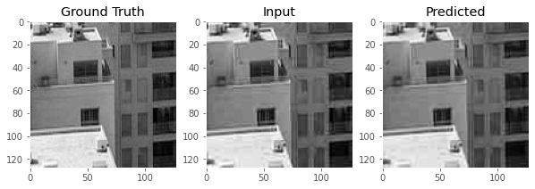

# ML_SRCNN-Super-Resolution-Convolutional-Neural-Network
Implementation of SRCNN architecture using Deep Learning and PyTorch

**Members** : <a href="https://github.com/nikitaoltyan">Nikita Oltyan</a>, <a href="https://github.com/arseniyzu">Arseniy Zubenya</a>

## Description

This project aims to improve image quality (image debluring) with the use of SRCNN model. The below image briefly explains the output we want:

<p align="center">

</p>


## Table of Content

* [Dataset](#dataset)

* [Model](#model)

* [PSNR Function](#psnr_function)

* [Results](#results)

* [Dependency](#dependency)

* [References](#references)


## Dataset <a name="dataset"></a>

The dataset contains:

**13056 train images (256x128)**

**3200 val images (256x128)**

You can find a whole lot of image dataset mainly used for super-resolution experimentation in this public <a href="https://drive.google.com/file/d/1QI3MvHTxFzwZfF1xdgJv0EJqB91yAzMG/view?usp=sharing">Google Drive folder</a>.

**All examples of training and validation data are groped into one picture with a good quality one on the left side and a poor quality on the right.**

<p align="center">

</p>

```sh
# The whole dataset preparing is available in the file.
Data_Preparing.ipynb
```

```sh
# The class for preparing data for using. It gets image directory, then gets data from there and divide images into quality and poor.
class SkylineDataset(Dataset):
    
    def __init__(self, image_dir):
        self.image_dir = image_dir
        self.image_fns = os.listdir(image_dir)
        
    def __len__(self):
        return len(self.image_fns)
    
    def __getitem__(self, index):
        image_fn = self.image_fns[index]
        image_fp = os.path.join(self.image_dir, image_fn)
        image = Image.open(image_fp).convert('L')
        quality, poor = self.split_image(image)
        quality = self.transform(quality)
        poor = self.transform(poor)
        return quality, poor
    
    def split_image(self, image):
        image = np.array(image)
        quality, poor = image[:, :128], image[:, 128:]
        return poor, quality

    def transform(self, image):
        transform_ops = transforms.Compose([
            transforms.ToTensor()
        ])
        return transform_ops(image)
```

Below the line you can find a story of an idea of that dataset and how we got that data.

---

After brief examination of our task we decided that there wasn’t any easy way of implementing Super Resolution for any image of any object we want.

We decided to concentrate our efforts on improving quality of skyline pictures. This is a common problem for a millions of traveling people – they often zoom horizon, trying to take their best pictures of sunsets/city skylines/historical sites.

```sh
# The quality of original images was decreased by Image function.
size = 1024, 1024
file_path = "some/file/path"
image = Image.open(file_path)
new_image= image.resize(size, Image.ANTIALIAS)
    
save_path = "some/new/file/path"
new_image.save(save_path, optimize=True, quality=20)
```

We’ve started with dataset of skyline pictures taken by Nikita from his flat using digital slr but they were too big for any existing models: 3024x4032 pixels.

So we resized them into 1024x1024, but it still was too big and expensive for resources:

<p align="center">

</p>

So we tried to crop them into batches of 16 pieces with 256x256 size each but is was hopeless. That gave us the 4000 items dataset that wasn’t enough, especially in difficult parts where sky and buildings are together. The pixelation didn’t disappear, but blur was added.

<p align="center">

</p>

In the final stage of data preparing we changed “RGB” color channels into “L” (black and white) and divided original images into batches of 64 pieces with 128x128 size each. That’s how we got our dataset that now available.

<p align="center">

</p>

> Other images were taken from <a href="https://varlamov.ru">that</a> website

## Model <a name="model"></a>

We used SRCNN architecture, that was discovered on that <a href="https://personal.ie.cuhk.edu.hk/~ccloy/files/eccv_2014_deepresolution.pdf">paper</a>.

According to the authors:

> We propose a deep learning method for single image super-resolution (SR).
> Our method directly learns an end-to-end mapping between the low/high-resolution images.
> The mapping is represented as a deep convolutional neural network (CNN)
> that takes the low-resolution image as the input and outputs the high-resolution one. 

We copied their architecture and trained our model for improving skylines photos with our dataset.

According to the authors, SRCNN shows the best results through Bicubic and SC techniques.

<p align="center">

</p>

But how it works? Authors suggested that there’s enough only 3 layers to do that.

Given a low-resolution image Y, the first convolutional layer of the SRCNN extracts a set of feature maps. The second layer maps these feature maps nonlinearly to high-resolution patch representations. The last layer combines the predictions within a spatial neighbourhood to produce the final high-resolution image F(Y).

<p align="center">

</p>

```sh
import torch.nn as nn
import torch.nn.functional as F

class SRCNN(nn.Module):
  
    def __init__(self):
        super(SRCNN, self).__init__()
        self.conv1 = nn.Conv2d(1, 64, kernel_size=9, padding=2, padding_mode='replicate')
        self.conv2 = nn.Conv2d(64, 32, kernel_size=1, padding=2, padding_mode='replicate')
        self.conv3 = nn.Conv2d(32, 1, kernel_size=5, padding=2, padding_mode='replicate')

    def forward(self, x):
        x = F.relu(self.conv1(x))
        x = F.relu(self.conv2(x))
        x = self.conv3(x)
        return x
```

Train function:

```sh
def train(model, dataloader):
    model.train()
    running_loss = 0.0
    running_psnr = 0.0
    
    for bi, data in tqdm(enumerate(dataloader), total=int(len(train_data)/dataloader.batch_size)):
        image_data = data[1].to(device)
        label = data[0].to(device)
        
        optimizer.zero_grad()
        outputs = model(image_data)
        
        loss = criterion(label, outputs)
        loss.backward()
        optimizer.step()
        running_loss += loss.item()

        batch_psnr =  psnr(outputs, label)
        running_psnr += batch_psnr

    final_loss = running_loss/len(dataloader.dataset)
    final_psnr = running_psnr/int(len(train_data)/dataloader.batch_size)
    return final_loss, final_psnr
```


## PSNR Function <a name="psnr_function"></a>

We can't estimate prediction of our model via loss or by eye, so we find a special function that can properly evaluate that result for us. It's called PSNR or Peak signal-to-noise ratio. That function helped us to know ratio between the maximum possible power of a signal (one monochrome channel) and the power of corrupting noise that affects the fidelity of its representation.

dB (PSNR) is a special logarithmic value of the ratio of the maximum pixel value (in our single-channel case, this value is 1) to the root-mean-square error (the difference between the value of the predicted pixel with respect to Ground Truth). **The higher PSNR –– the better.**

We thought it was a good idea to use this metric, because it is often used to evaluate image compression.

More information about that parameter is avaialbe <a href="https://en.wikipedia.org/wiki/Peak_signal-to-noise_ratio">here</a>.

That's how function for implementing that looks like:

```sh
def psnr(label, outputs, max_val=1.):
    """
    Peak Signal to Noise Ratio (the higher the better).
    PSNR = 20 * log10(MAXp) - 10 * log10(MSE).
    label and outputs – Torch tensors.
    """
    label = label.cpu().detach().numpy()
    outputs = outputs.cpu().detach().numpy()
    img_diff = outputs - label
    rmse = math.sqrt(np.mean((img_diff) ** 2))
    if rmse == 0:
        return 100
    else:
        PSNR = 20 * math.log10(max_val / rmse)
        return PSNR
```


## Results <a name="results"></a>

After training the given function we got this results:

<p align="center">

</p>

---

<p align="center">

</p>

As you can see, PSNR growed and stoped near 30 (it should be mentiond the dB range between 30 and 40 is cosidered as a good result). There was no point in continuing the training because of stop in decreasing of loss.

We tested a banch of images:

```sh
test_batch_size = 8
dataset = SkylineDataset(train_dir)
data_loader = DataLoader(dataset, batch_size=test_batch_size)

X, Y = next(iter(data_loader))
Y_pred = model(X)

fig, axes = plt.subplots(1, 3, figsize=(10, 5))
use_image = 7

truth = torchvision.utils.make_grid(Y[use_image], nrow=1)
truth = truth.permute(1, 2, 0).detach().numpy()
input = torchvision.utils.make_grid(X[use_image], nrow=1)
input = input.permute(1, 2, 0).detach().numpy()
pred = torchvision.utils.make_grid(Y_pred[use_image], nrow=1)
pred = pred.permute(1, 2, 0).detach().numpy()


axes[0].imshow(truth)
axes[0].set_title("Ground Truth")
axes[1].imshow(input)
axes[1].set_title("Input")
axes[2].imshow(pred)
axes[2].set_title("Predicted")
```

And we got that predicted result:

<p align="center">

</p>

This is the approximate improvement of the image quality by our model:

| Input dB | Output dB | Improvement |
| ------ | ------ | ------ |
| 28 | 31 | 10.7% |

We took a random photo not from our dataset, resized it to 1024x1024. Then we crop into 64 pieces and apply to our model then reassembled it. Here's the result:

<p align="center">

</p>

**The best weights are available. Just download the following file:**

```sh
chechpoint.pth
```

And just apply it to your SRCNN model:

```sh
model = SRCNN().to(device)
model.load_state_dict(torch.load('checkpoint.pth'))
```

## Dependency <a name="dependency"></a>

Following modules are used in the project:

    * python >= 3.6
    * numpy >= 1.19.5
    * torch >= 1.8.1
    * torchvision >= 0.9.1
    * PIL.Image >= 7.1.2
    * matplotlib >= 3.2.2

## References <a name="references"></a>

[1] C. Dong, C. Change Loy, K. He, and X. Tang. Learning a Deep Convolutional Network for Image Super-Resolution, https://personal.ie.cuhk.edu.hk/~ccloy/files/eccv_2014_deepresolution.pdf
[1] I. Varlamov. Urban Photographer, https://varlamov.ru
